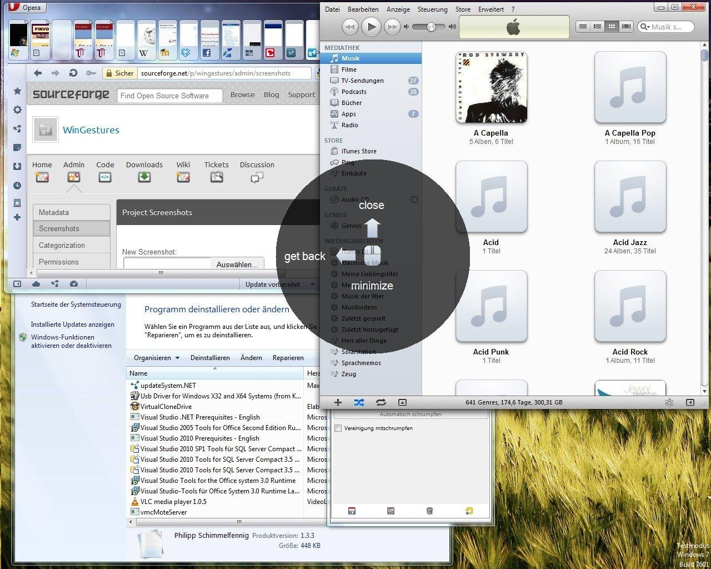
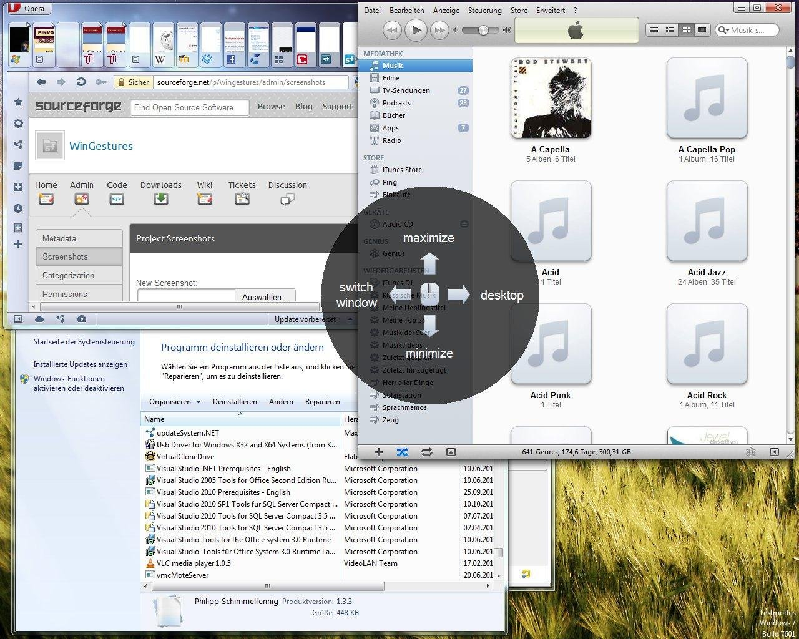

# WinGestures

## Control Windows with mouse gestures

Windows can be controlled by pressing the middle mouse button and performing a gesture.

This repository is a mirror of the original SourceForge project:
https://sourceforge.net/projects/wingestures/

## Project Samples

## Releases

- `releases/v1.0/WinGestures.msi`
